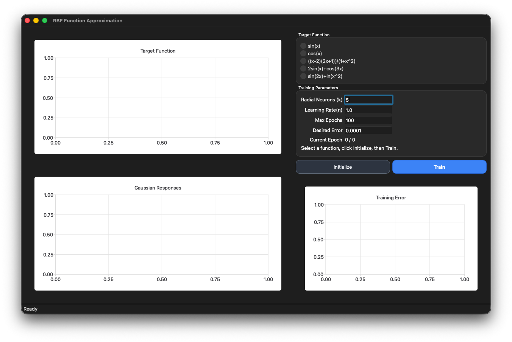
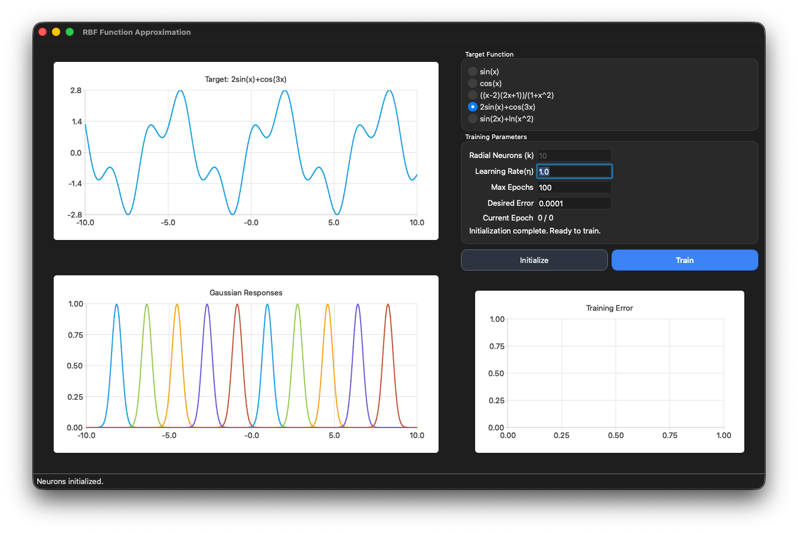
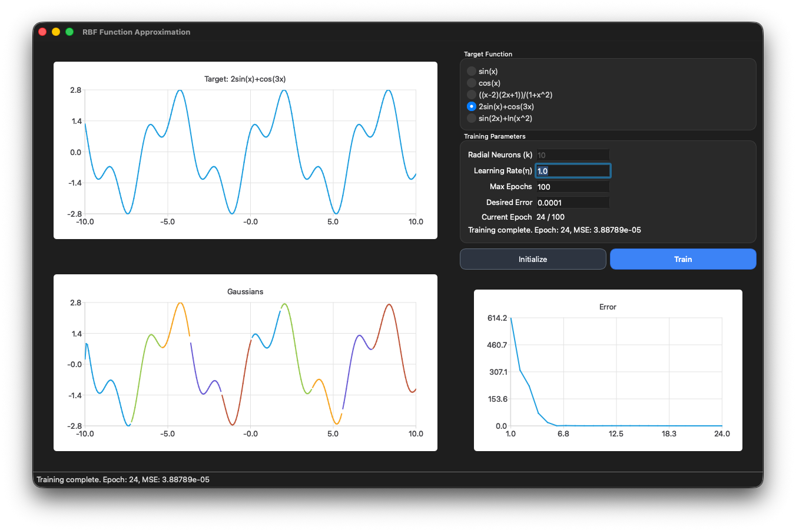

# Qt RBF Function Approximation

Interactive Qt desktop application for 1D function approximation with a Radial Basis Function (RBF) neural network. The app is focused on learning and visualization: you can choose a target function, initialize the RBF layer, train, and inspect charts for the function, Gaussian responses, and error evolution.

## Features

- Function approximation with an RBF network (Gaussian hidden neurons + linear output neuron)
- Multiple built-in target functions
- Configurable training controls:
	- Number of radial neurons (k)
	- Learning rate
	- Maximum epochs
	- Desired error
- Real-time chart updates for:
	- Target function
	- Gaussian neuron curves
	- Training error per epoch

## Target Functions

The UI provides these target functions:

- sin(x)
- cos(x)
- ((x - 2)(2x + 1)) / (1 + x^2)
- 2sin(x) + cos(3x)
- sin(2x) + ln(x^2)

## Requirements

- Qt 6 with modules:
	- Core
	- Gui
	- Widgets
	- Charts
- C++17 compiler
- qmake and make

## Build

From the repository root:

```bash
qmake RBF.pro
make
```

## Run

After building, run the generated executable:

```bash
./RBF
```

If your build system outputs binaries in a separate build directory, run the executable from that location.

## How to Use

1. Select a target function (Sine, Cosine, or one of the custom formulas).
2. Set k (number of Gaussian/radial neurons).
3. Click Initialize to create radial and linear neurons.
4. Set learning rate, max epochs, and desired error.
5. Click Train.
6. Watch the charts:
	 - Top chart: selected target function
	 - Gaussian chart: radial neuron responses / grouped outputs
	 - Error chart: training error across epochs

## Model Overview

The network predicts:

z(x) = sum(w_j * phi_j(x)) + b

Where:

- phi_j(x) is the Gaussian activation of radial neuron j
- w_j are linear output weights
- b is the output bias

At a high level, training follows three phases in the app logic:

1. Assign inputs to nearest radial centers and update centers by averages.
2. Set each radial spread using nearest-neighbor center distance.
3. Update linear output weights iteratively using error-driven learning.

## Project Structure

```text
src/
	app/
		main.cpp              # Qt application entry point
	neurons/
		radialneuron.*        # Gaussian radial neuron logic
		linearneuron.*        # Linear output neuron logic
	ui/
		mainwindow.*          # Training workflow, charts, and UI handlers
		mainwindow.ui         # Qt Designer UI definition
RBF.pro                   # qmake project file
```

## Screenshots





## Limitations

- Single-input (1D) function approximation only
- Educational implementation; not optimized as a general ML toolkit
- Uses a simple update strategy and fixed UI-driven workflow
- No automated tests included yet

## License

This project is licensed under GPL-3.0-only. See [LICENSE](LICENSE).
